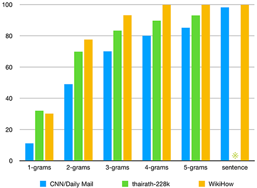

# thairath-228k
**A Large Dataset for Thai Text Summarization from thairath.co.th.**
Dowload the dataset [here](https://drive.google.com/file/d/1IUoKGFjGF4hxnAQ19-l12zAXTmw0V4s7/view?usp=sharing).

The `thairath-228k` dataset is crawled from the news site [Thairath](https://www.thairath.co.th/home "Thairath"). This dataset is purposefully scraped for evaluating various Thai NLP tasks especially text summarisation and classification-benchmarks. We filtered out those articles which match, at least, one of following conditions:
- Article that contains following tags: `นิยาย` (novel), อินสตราแกรมดารา (celebrity Instagram), `คลิปสุดฮา` (funny clip), `สรุปข่าว` (highlight news), `ดวง` (horoscope )
- Article body contains less than 230 words.
- Summary contains less than 8 words.
- The abstractedness of the summary at 1-grams is less than 65%. 

After filtering, it contains 228,937 articles with 388,383 tags from October 1, 2014 to October 21, 2019. This dataset was crawled and cleaned by [@nakhunchumpolsathien](https://github.com/nakhunchumpolsathien) and [@CaramelWaffle](https://github.com/caramelWaffle). You can see preliminary exploration in `exploration.ipynb`.

### `thairath-228k` Dataset Statistics

| Properties     | Value |
| :--------- | -----:|
| Dataset Size  | 228,937 |
| Average Article Length     |   478.44 |
| Average Summary Length     |    46.54 |
| Average Title Length |      To be updated    |
| Unique Tag Size |  388,383 |
| Vocabulary Size | To be updated |
### Level of Abstractedness
Abstractedness of the dataset is measured by calculating the unique n-grams in the reference summary which are not in the article. We compare the abstractedness level of `thairath-228k` dataset to `CNN/Daily Mail` and `WikiHow` dataset. The comparison is shown below figure.

> ※ The abstractedness at sentence level of `thairath-228k` is to be updated.
### Experimental Results

#### Classification-benchmarks
 >※ To be updated 
#### Thai Text Summarization
 >※ To be updated 